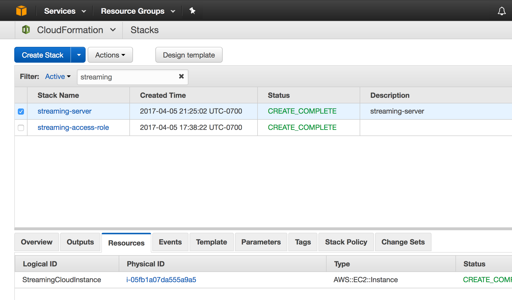

create access-role stack
--

delete stack
---

```bash
aws cloudformation delete-stack --stack-name streaming-access --region us-west-2 --profile creds-federated
```

```bash
aws cloudformation create-stack --stack-name streaming-access-role --template-body file://StreamingAccessRoleCF.json --profile creds-federated --region us-west-2 --capabilities CAPABILITY_IAM
{
    "StackId": "arn:aws:cloudformation:us-west-2:033814027302:stack/streaming-access-role/4c2718b0-1a61-11e7-903b-503ac931688d"
}
```

describe access-role stack
--

```bash
aws cloudformation describe-stacks --stack-name streaming-access-role --region us-west-2 --profile aws-federated
{
    "Stacks": [
        {
            "StackId": "arn:aws:cloudformation:us-west-2:033814027302:stack/streaming-access-role/b2c41660-1a5f-11e7-80b3-50d5ca11b8d2", 
            "Tags": [], 
            "CreationTime": "2017-04-06T00:26:57.902Z", 
            "Capabilities": [
                "CAPABILITY_IAM"
            ], 
            "StackName": "streaming-access-role", 
            "NotificationARNs": [], 
            "StackStatus": "ROLLBACK_COMPLETE", 
            "DisableRollback": false
        }
    ]
}
```

```
aws iam list-roles --region us-west-2 --profile aws-federated | grep streaming
```

create instance stack
---

```bash
aws cloudformation create-stack --stack-name streaming-server --template-body file://StreamingCloudInstance.json --profile aws-federated --region us-west-2
```

```bash

{
    "Reservations": [
        {
            "OwnerId": "033814027302", 
            "ReservationId": "r-0771a516c2404da38", 
            "Groups": [], 
            "Instances": [
                {
                    "Monitoring": {
                        "State": "disabled"
                    }, 
                    "PublicDnsName": "", 
                    "State": {
                        "Code": 16, 
                        "Name": "running"
                    }, 
                    "EbsOptimized": false, 
                    "LaunchTime": "2017-04-06T07:05:51.000Z", 
                    "PrivateIpAddress": "172.18.21.200", 
                    "ProductCodes": [], 
                    "VpcId": "vpc-5374e434", 
                    "StateTransitionReason": "", 
                    "InstanceId": "i-0d367568b1f2178b6", 
                    "ImageId": "ami-6f68cf0f", 
                    "PrivateDnsName": "ip-172-18-21-200.us-west-2.compute.internal", 
                    "KeyName": "api-staging", 
                    "SecurityGroups": [
                        {
                            "GroupName": "nihilos-sg", 
                            "GroupId": "sg-5491da2c"
                        }
                    ], 
                    "ClientToken": "strea-Strea-OE5460VK3IAC", 
                    "SubnetId": "subnet-8c7ecbeb", 
                    "InstanceType": "t2.large", 
                    "NetworkInterfaces": [
                        {
                            "Status": "in-use", 
                            "MacAddress": "02:e0:50:e4:fe:ad", 
                            "SourceDestCheck": true, 
                            "VpcId": "vpc-5374e434", 
                            "Description": "", 
                            "NetworkInterfaceId": "eni-7c854b0e", 
                            "PrivateIpAddresses": [
                                {
                                    "PrivateDnsName": "ip-172-18-21-200.us-west-2.compute.internal", 
                                    "Primary": true, 
                                    "PrivateIpAddress": "172.18.21.200"
                                }
                            ], 
                            "PrivateDnsName": "ip-172-18-21-200.us-west-2.compute.internal", 
                            "Attachment": {
                                "Status": "attached", 
                                "DeviceIndex": 0, 
                                "DeleteOnTermination": true, 
                                "AttachmentId": "eni-attach-68754b0d", 
                                "AttachTime": "2017-04-06T07:05:51.000Z"
                            }, 
                            "Groups": [
                                {
                                    "GroupName": "nihilos-sg", 
                                    "GroupId": "sg-5491da2c"
                                }
                            ], 
                            "Ipv6Addresses": [], 
                            "SubnetId": "subnet-8c7ecbeb", 
                            "OwnerId": "033814027302", 
                            "PrivateIpAddress": "172.18.21.200"
                        }
                    ], 
                    "SourceDestCheck": true, 
                    "Placement": {
                        "Tenancy": "default", 
                        "GroupName": "", 
                        "AvailabilityZone": "us-west-2b"
                    }, 
                    "Hypervisor": "xen", 
                    "BlockDeviceMappings": [
                        {
                            "DeviceName": "/dev/sda1", 
                            "Ebs": {
                                "Status": "attached", 
                                "DeleteOnTermination": true, 
                                "VolumeId": "vol-0e4f8b3ee0a704ac6", 
                                "AttachTime": "2017-04-06T07:05:51.000Z"
                            }
                        }
                    ], 
                    "Architecture": "x86_64", 
                    "RootDeviceType": "ebs", 
                    "IamInstanceProfile": {
                        "Id": "AIPAJP7DAZV7NOXFYVGN4", 
                        "Arn": "arn:aws:iam::033814027302:instance-profile/streaming-server-StreamingInstanceProfile-1VNXOMAOMNXE7"
                    }, 
                    "RootDeviceName": "/dev/sda1", 
                    "VirtualizationType": "hvm", 
                    "Tags": [
                        {
                            "Value": "StreamingCloudInstance", 
                            "Key": "aws:cloudformation:logical-id"
                        }, 
                        {
                            "Value": "arn:aws:cloudformation:us-west-2:033814027302:stack/streaming-server/2ab701f0-1a97-11e7-9d46-503acbd4dc99", 
                            "Key": "aws:cloudformation:stack-id"
                        }, 
                        {
                            "Value": "streaming-server", 
                            "Key": "Name"
                        }, 
                        {
                            "Value": "streaming-server", 
                            "Key": "aws:cloudformation:stack-name"
                        }
                    ], 
                    "AmiLaunchIndex": 0
                }
            ]
        }
   ]
}
```



Resources
-----------

http://docs.aws.amazon.com/AWSCloudFormation/latest/UserGuide/aws-resource-kinesis-stream.html

[aws-resource-iam-role](http://docs.aws.amazon.com/AWSCloudFormation/latest/UserGuide/aws-resource-iam-role.html)

[Amazon EC2 Template Snippets](http://docs.aws.amazon.com/AWSCloudFormation/latest/UserGuide/quickref-ec2.html)

[](http://docs.aws.amazon.com/AWSCloudFormation/latest/UserGuide/aws-resource-iam-instanceprofile.html)
