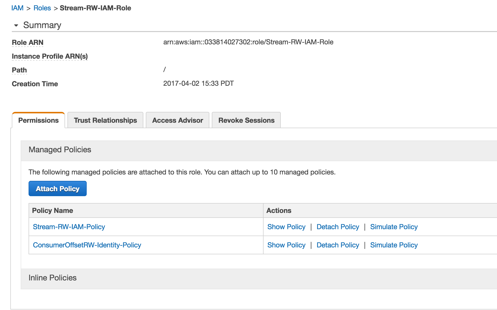

elastic compute cloud (ec2) to kinesis-stream connection example
----------------------------------------------------------------

1 - [amazonwebservice cli](https://github.com/aws/aws-cli#installation)
-----------------------------------------------------------------------
```bash
sudo pip install awscli
```

2- [kinesis IAM(Identity and Access Management)](http://docs.aws.amazon.com/streams/latest/dev/learning-kinesis-module-one-iam.html) role - [`Stream-RW-IAM-Role`](https://console.aws.amazon.com/iam/home#/policies$new)
-----------------------------------------------------------------------------------------------------------------------------------------------------------------------------------------

_difference between role and policy : I think access policies are attached to the Roles?_ 

```
#first create a Identity role
aws iam create-role --role-name Stream-RW-IAM-Role --assume-role-policy-document file://ConsumerOffset-RW-Role.json --profile aws-creds-federated
```

```bash
#then create an access policy the Role create earlier
aws iam create-policy --policy-name Stream-RW-IAM-Policy --policy-document file://Stream-RW-IAM-Policy.json --profile aws-creds-federated
{
    "PolicyName": "Stream-RW-IAM-Policy", 
    "CreateDate": "2017-04-01T07:41:43Z", 
    "AttachmentCount": 0, 
    "IsAttachable": true, 
    "PolicyId": "ANPAIRSG5BAZCQQEZOMFK", 
    "DefaultVersionId": "v1", 
    "Path": "/", 
    "Arn": "arn:aws:iam::033814027302:policy/Stream-RW-IAM-Policy", 
    "UpdateDate": "2017-04-01T07:41:43Z"
}
```


```
# now attach the Stream access policy to the Role, so that Role can be used elsewhere now to access the stream
aws iam attach-role-policy --role-name Stream-RW-IAM-Role --policy-arn arn:aws:iam::033814027302:policy/Stream-RW-IAM-Policy --profile aws-creds-federated
```

create Identity policy for kinesis consumer offset,

```bash
$ aws iam create-policy --policy-name ConsumerOffsetRW-Identity-Policy --policy-document file://ConsumerOffset-RW-Policy.json --profile aws-creds-federated
{
    "Policy": {
        "PolicyName": "ConsumerOffsetRW-Identity-Policy", 
        "CreateDate": "2017-04-02T20:53:43.974Z", 
        "AttachmentCount": 0, 
        "IsAttachable": true, 
        "PolicyId": "ANPAJV4G77ZCTESBGJ4VW", 
        "DefaultVersionId": "v1", 
        "Path": "/", 
        "Arn": "arn:aws:iam::033814027302:policy/ConsumerOffsetRW-Identity-Policy", 
        "UpdateDate": "2017-04-02T20:53:43.974Z"
    }
}

# now attach the OffsetTable access policy to the Role, so that Role can be used elsewhere to access the stream as well ConsumerOffset
aws iam attach-role-policy --role-name Stream-RW-IAM-Role --policy-arn arn:aws:iam::033814027302:policy/ConsumerOffsetRW-Identity-Policy --profile aws-creds-federated
```



```
aws iam list-roles --profile aws_creds_federated
aws iam list-policies --profile aws_creds_federated ## will list the Stream-RW-IAM-Role

        {
            "PolicyName": "Stream-RW-IAM-Role", 
            "CreateDate": "2017-04-01T07:41:43Z", 
            "AttachmentCount": 0, 
            "IsAttachable": true, 
            "PolicyId": "ANPAIRSG5BAZCQQEZOMFK", 
            "DefaultVersionId": "v1", 
            "Path": "/", 
            "Arn": "arn:aws:iam::033814027302:policy/Stream-RW-IAM-Role", 
            "UpdateDate": "2017-04-01T07:41:43Z"
        }


aws iam list-instance-profiles-for-role --role-name Stream-RW-IAM-Role --profile aws_creds_federated
```

```
aws iam list-instance-profiles-for-role --role-name Stream-RW-IAM-Role --profile aws-creds-federated
{
    "InstanceProfiles": []
}
```

elastic cloud instance config
-----------------------------

[create an instance](http://docs.aws.amazon.com/cli/latest/userguide/cli-ec2-launch.html#launching-instances)
------------------

```
aws ec2 describe-vpcs --region us-west-2 --profile aws-creds--federated ## there would be one VirtualPrivateCloud

#VirtualPrivateCloudId + sGroupId
aws ec2 describe-security-groups --profile aws-creds-federated --region us-west-2

#4 subnets for VirtualPrivateCloud + SubnetId + AvailabilityZone(2a and 2b)
aws ec2 describe-subnets --profile aws-creds-federated --region us-west-2 

aws ec2 create-key-pair --region us-west-2 --key-name api-staging --profile aws-creds-federated


#redhat - ami-6f68cf0f

aws ec2 run-instances --image-id ami-6f68cf0f --count 1 --instance-type t2.micro --key-name api-staging --security-group-ids sg-5491da2c --subnet-id subnet-8c7ecbeb --region us-west-2 --profile aws-creds-federated
{
    "OwnerId": "033814027302", 
    "ReservationId": "r-0f5bd3e2e7b8e55bc", 
    "Groups": [], 
    "Instances": [
        {
            "Monitoring": {
                "State": "disabled"
            }, 
            "PublicDnsName": "", 
            "RootDeviceType": "ebs", 
            "State": {
                "Code": 0, 
                "Name": "pending"
            }, 
            "EbsOptimized": false, 
            "LaunchTime": "2017-04-02T22:11:18.000Z", 
            "PrivateIpAddress": "172.18.21.240", 
            "ProductCodes": [], 
            "VpcId": "vpc-5374e434", 
            "StateTransitionReason": "", 
            "InstanceId": "i-05f86d5876b06acf7", 
            "ImageId": "ami-6f68cf0f", 
            "PrivateDnsName": "ip-172-18-21-240.us-west-2.compute.internal", 
            "KeyName": "api-staging", 
            "SecurityGroups": [
                {
                    "GroupName": "nihilos-test", 
                    "GroupId": "sg-5491da2c"
                }
            ], 
            "ClientToken": "", 
            "SubnetId": "subnet-8c7ecbeb", 
            "InstanceType": "t2.micro", 
            "NetworkInterfaces": [
                {
                    "Status": "in-use", 
                    "MacAddress": "02:f7:f8:f8:3c:63", 
                    "SourceDestCheck": true, 
                    "VpcId": "vpc-5374e434", 
                    "Description": "", 
                    "NetworkInterfaceId": "eni-4ef5013c", 
                    "PrivateIpAddresses": [
                        {
                            "PrivateDnsName": "ip-172-18-21-240.us-west-2.compute.internal", 
                            "Primary": true, 
                            "PrivateIpAddress": "172.18.21.240"
                        }
                    ], 
                    "PrivateDnsName": "ip-172-18-21-240.us-west-2.compute.internal", 
                    "Attachment": {
                        "Status": "attaching", 
                        "DeviceIndex": 0, 
                        "DeleteOnTermination": true, 
                        "AttachmentId": "eni-attach-56654833", 
                        "AttachTime": "2017-04-02T22:11:18.000Z"
                    }, 
                    "Groups": [
                        {
                            "GroupName": "nihilos-test", 
                            "GroupId": "sg-5491da2c"
                        }
                    ], 
                    "Ipv6Addresses": [], 
                    "SubnetId": "subnet-8c7ecbeb", 
                    "OwnerId": "033814027302", 
                    "PrivateIpAddress": "172.18.21.240"
                }
            ], 
            "SourceDestCheck": true, 
            "Placement": {
                "Tenancy": "default", 
                "GroupName": "", 
                "AvailabilityZone": "us-west-2b"
            }, 
            "Hypervisor": "xen", 
            "BlockDeviceMappings": [], 
            "Architecture": "x86_64", 
            "StateReason": {
                "Message": "pending", 
                "Code": "pending"
            }, 
            "RootDeviceName": "/dev/sda1", 
            "VirtualizationType": "hvm", 
            "AmiLaunchIndex": 0
        }
    ]
}


```

- [attach Stream Identity Role to elastic cloud instance](http://docs.aws.amazon.com/cli/latest/reference/iam/add-role-to-instance-profile.html)

https://aws.amazon.com/blogs/security/new-attach-an-aws-iam-role-to-an-existing-amazon-ec2-instance-by-using-the-aws-cli/


```bash
aws iam add-role-to-instance-profile --role-name Stream-RW-IAM-Role --instance-profile-name AIPAIWEWPMRBPJ7XON6FI
```

```
[ec2-user@ip-172-18-18-8 elastic2-kinesis-connection]$ curl -XGET http://169.254.169.254/latest/meta-data/iam/info
{
  "Code" : "Success",
  "LastUpdated" : "2017-04-01T06:28:05Z",
  "InstanceProfileArn" : "arn:aws:iam::033814027302:instance-profile/Stream-RW-IAM-Role",
  "InstanceProfileId" : "AIPAIWEWPMRBPJ7XON6FI"
}
```


run artifact on elastic compute
-------------------------------

```
wget https://dl.bintray.com/sbt/native-packages/sbt/0.13.13/sbt-0.13.13.tgz

sbt-launcher-packaging-0.13.13/bin/sbt test
```

Refs
----

https://console.aws.amazon.com/iam/home?region=us-west-2#/roles

http://docs.aws.amazon.com/IAM/latest/UserGuide/id_roles_use_switch-role-ec2.html

http://docs.aws.amazon.com/IAM/latest/UserGuide/id_roles_use_switch-role-ec2_instance-profiles.html

http://docs.aws.amazon.com/codedeploy/latest/userguide/getting-started-create-iam-instance-profile.html

http://docs.aws.amazon.com/cli/latest/userguide/cli-chap-getting-started.html

https://aws.amazon.com/blogs/security/demystifying-ec2-resource-level-permissions/

https://cloudranger.com/how-to-configure-the-aws-cli-and-launch-an-ec2-instance/

https://coderwall.com/p/ndm54w/creating-an-ec2-instance-in-a-vpc-with-the-aws-command-line-interface

Troubleshoot
------------

```bash
$ aws sts decode-authorization-message --encoded-message ex73GK_MP7wAt-kujuvWUCw-EN1EhLZWRF5c-ry1xxxmiOmkKimfo975WzO3mXlKHdbtzpPbrGXGlov3H3XwIRiVmRwDmruyD2JQYVJ-trmTfuhuTrJDU_KUaG-hjyRHK0a1WnoatbGF8q5E-8HWL3OuncHbHqNRY9HpdD3_sAIWaSJxYPun1dzNSnxbZXGAlMH82NJGMqPfSPzTSKnZ5RxAgyXOnjq5ZuZFVFpqXck3zIhyHs8UknlbRXBBsgmPCgvGsqo5EoKw8SpnvxL73-q1bZihoUnoQdFUMGQOpuyKMpe1NNpFmmm5aPe7rf9Qrg-89cA-FSDykRNJMGRypF-aaHmDPoHO-CUVnsPtsJHCQU2bxMvh91sU9id9_oyr0TlY0KzHdbCqaMK6Q-Va6cWe5z-qS1z516ThYXbWU_hLUwucWIrPDyuROPWz9pTmDTz3c9XN2XLD999ViDF3tVtlCqmG8orIBcsEscznMubFsXaKgcT7j98lCZkfx5CUGS-8fZYes4AL-wDNfenE-Cw6CziRXgn-lvsp861R6dX-UH-8x3_50VMODM0HakgsLXFI3Rf9tHxNU-kXjaDcMsI5_Vf2VWLLe_TnBv_fgzSN8k3I4nk0yz3Jg_Rqeu4TOyBC38aNYLwrqivljwe5B42zR_NAld0wNj28EROdXLci89naoCXubG9UXyUf
```