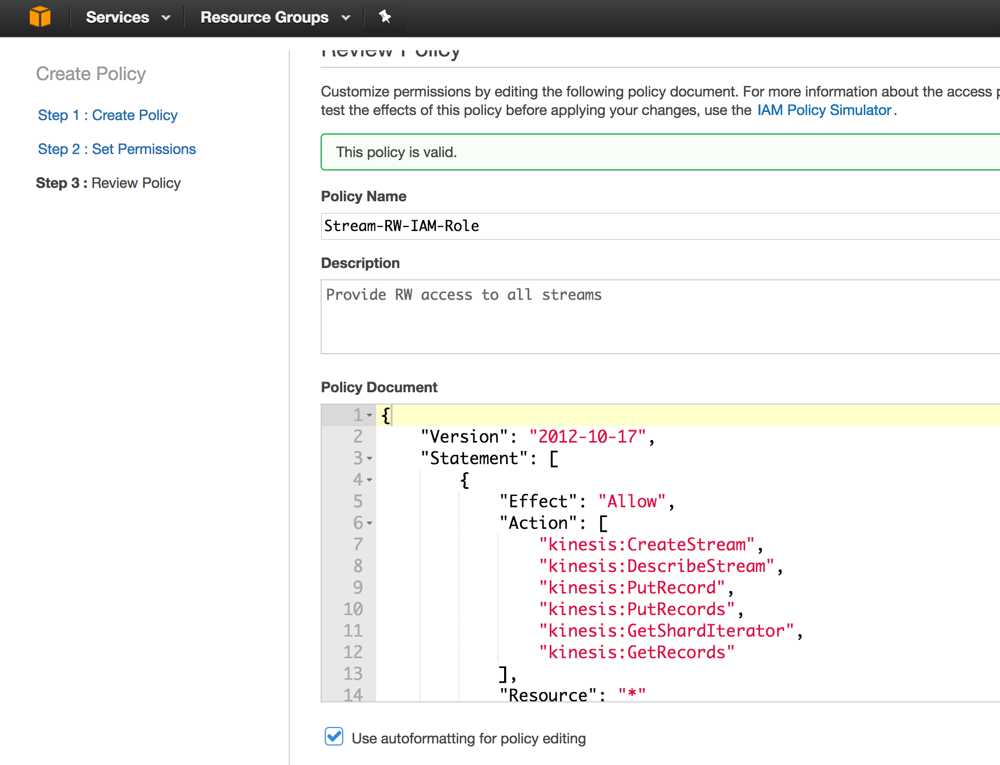

elastic compute cloud (ec2) to kinesis-stream connection example
----------------------------------------------------------------

1 - [amazonwebservice cli](https://github.com/aws/aws-cli#installation)
-----------------------------------------------------------------------

```bash
sudo pip install awscli
```

2- [Kinesis-Stream IAM(Identity and Access Management)](http://docs.aws.amazon.com/streams/latest/dev/learning-kinesis-module-one-iam.html) role - [`StreamOffset-RW-IAM-Role`](https://console.aws.amazon.com/iam/home#/policies$new)
-----------------------------------------------------------------------------------------------------------------------------------------------------------------------------------------

_difference between role and policy : individual policies are attached to the Roles?_ 

```bash
#first create a Identity role
aws iam create-role --role-name StreamOffset-RW-IAM-Role --assume-role-policy-document file://StreamOffset-RW-Role.json --profile aws-creds-federated
```

```bash
#then create an access policy the Role create earlier
aws iam create-policy --policy-name Stream-RW-IAM-Policy --policy-document file://Stream-RW-IAM-Policy.json --profile aws-creds-federated
{
    "PolicyName": "Stream-RW-IAM-Policy", 
    "CreateDate": "2017-04-01T07:41:43Z", 
    "AttachmentCount": 0, 
    "IsAttachable": true, 
    "PolicyId": "ANPAIRSG5BAZCQQEZOMFK", 
    "DefaultVersionId": "v1", 
    "Path": "/", 
    "Arn": "arn:aws:iam::033814027302:policy/Stream-RW-IAM-Policy", 
    "UpdateDate": "2017-04-01T07:41:43Z"
}
```



```bash
# now attach the Stream access policy to the Role, so that Role can be used elsewhere now to access the stream
aws iam attach-role-policy --role-name Stream-RW-IAM-Role --policy-arn arn:aws:iam::033814027302:policy/Stream-RW-IAM-Policy --profile aws-creds-federated
```

create Identity policy for kinesis consumer offset
--

```bash
$ aws iam create-policy --policy-name ConsumerOffsetRW-Identity-Policy --policy-document file://ConsumerOffset-RW-Policy.json --profile aws-creds-federated
{
    "Policy": {
        "PolicyName": "ConsumerOffsetRW-Identity-Policy", 
        "CreateDate": "2017-04-02T20:53:43.974Z", 
        "AttachmentCount": 0, 
        "IsAttachable": true, 
        "PolicyId": "ANPAJV4G77ZCTESBGJ4VW", 
        "DefaultVersionId": "v1", 
        "Path": "/", 
        "Arn": "arn:aws:iam::033814027302:policy/ConsumerOffsetRW-Identity-Policy", 
        "UpdateDate": "2017-04-02T20:53:43.974Z"
    }
}

# now attach the OffsetTable access policy to the Role, so that Role can be used elsewhere to access the stream as well ConsumerOffset
aws iam attach-role-policy --role-name StreamOffset-RW-IAM-Role --policy-arn arn:aws:iam::033814027302:policy/ConsumerOffsetRW-Identity-Policy --profile aws-creds-federated
```

```bash
aws iam list-roles --profile aws_creds_federated
aws iam list-policies --profile aws_creds_federated ## | grep x => will list the Stream-RW-IAM-Role
{
    "Policies": [
        {
            "PolicyName": "ConsumerOffsetRW-Identity-Policy", 
            "CreateDate": "2017-04-02T20:53:43Z", 
            "AttachmentCount": 2, 
            "IsAttachable": true, 
            "PolicyId": "ANPAJV4G77ZCTESBGJ4VW", 
            "DefaultVersionId": "v1", 
            "Path": "/", 
            "Arn": "arn:aws:iam::033814027302:policy/ConsumerOffsetRW-Identity-Policy", 
            "UpdateDate": "2017-04-02T20:53:43Z"
        },
        {
            "PolicyName": "Stream-RW-IAM-Role", 
            "CreateDate": "2017-04-01T07:41:43Z", 
            "AttachmentCount": 0, 
            "IsAttachable": true, 
            "PolicyId": "ANPAIRSG5BAZCQQEZOMFK", 
            "DefaultVersionId": "v1", 
            "Path": "/", 
            "Arn": "arn:aws:iam::033814027302:policy/Stream-RW-IAM-Role", 
            "UpdateDate": "2017-04-01T07:41:43Z"
        }
     ]
}

aws iam list-role-policies --role-name a0135-streaming-access-role-st-StreamingAccessRole-14QHMTIOIRN5X --region us-west-2 --profile aws-federated
```

```bash
aws iam list-instance-profiles-for-role --role-name Stream-RW-IAM-Role --profile aws-creds-federated
{
    "InstanceProfiles": []
}
```

elastic cloud instance config
-----------------------------

[create an instance](http://docs.aws.amazon.com/cli/latest/userguide/cli-ec2-launch.html#launching-instances)
------------------

```bash
aws ec2 describe-vpcs --region us-west-2 --profile aws-creds-federated ## there would be one VirtualPrivateCloud

## whats the Classless IDR block of given vpc your ec2 VM is on? - 172.23.0.0/16
aws ec2 describe-vpcs --vpc-ids vpc-a77a82c2 --region us-west-2 --profile aws-federated
{
    "Vpcs": [
        {
            "VpcId": "vpc-a77a82c2", 
            "InstanceTenancy": "default", 
            "Tags": [
                {
                    "Value": "staging-env", 
                    "Key": "Environment"
                }, 
                {
                    "Value": "VPC", 
                    "Key": "aws:cloudformation:logical-id"
                }, 
                {
                    "Value": "vpc_staging-env", 
                    "Key": "Name"
                }, 
                {
                    "Value": "VPN Connected VPC", 
                    "Key": "Network"
                }, 
                {
                    "Value": "arn:aws:cloudformation:us-west-2:500238854089:stack/VPCStagingEnv/7d05fd50-1db8-11e4-a0df-50e2414b0a44", 
                    "Key": "aws:cloudformation:stack-id"
                }, 
                {
                    "Value": "VPCStagingEnv", 
                    "Key": "aws:cloudformation:stack-name"
                }, 
                {
                    "Value": "319", 
                    "Key": "Connection"
                }
            ],
            "State": "available", 
            "DhcpOptionsId": "dopt-d26e81b7",
            "CidrBlock": "172.23.0.0/16",
            "IsDefault": false
        }
    ]
}

# VirtualPrivateCloudId + sGroupId (could be n number of sgs)
# has all the firewall rules for ingress and egress

aws ec2 describe-security-groups --profile aws-creds-federated --region us-west-2

aws ec2 describe-security-groups --group-id sg-5491da2c --region us-west-2 --profile aws-creds-federated
{
    "SecurityGroups": [
        {
            "IpPermissionsEgress": [
                {
                    "IpProtocol": "-1", 
                    "PrefixListIds": [], 
                    "IpRanges": [
                        {
                            "CidrIp": "0.0.0.0/0"
                        }
                    ], 
                    "UserIdGroupPairs": [], 
                    "Ipv6Ranges": []
                }
            ], 
            "Description": "nihilos sg", 
            "IpPermissions": [
                {
                    "PrefixListIds": [], 
                    "FromPort": 80, 
                    "IpRanges": [
                        {
                            "CidrIp": "10.0.0.0/8"
                        }, 
                        {
                            "CidrIp": "172.0.0.0/8"
                        }, 
                        {
                            "CidrIp": "0.0.0.0/0"
                        }
                    ], 
                    "ToPort": 80, 
                    "IpProtocol": "tcp", 
                    "UserIdGroupPairs": [], 
                    "Ipv6Ranges": [
                        {
                            "CidrIpv6": "::/0"
                        }
                    ]
                }, 
                {
                    "PrefixListIds": [], 
                    "FromPort": 8080, 
                    "IpRanges": [
                        {
                            "CidrIp": "0.0.0.0/0"
                        }, 
                        {
                            "CidrIp": "161.181.253.20/32"
                        }
                    ], 
                    "ToPort": 8080, 
                    "IpProtocol": "tcp", 
                    "UserIdGroupPairs": [], 
                    "Ipv6Ranges": [
                        {
                            "CidrIpv6": "::/0"
                        }
                    ]
                }, 
                {
                    "PrefixListIds": [], 
                    "FromPort": 22, 
                    "IpRanges": [
                        {
                            "CidrIp": "10.0.0.0/8"
                        }, 
                        {
                            "CidrIp": "172.16.0.0/12"
                        }
                    ], 
                    "ToPort": 22, 
                    "IpProtocol": "tcp", 
                    "UserIdGroupPairs": [], 
                    "Ipv6Ranges": []
                }
            ], 
            "GroupName": "nihilos-test", 
            "VpcId": "vpc-5374e434", 
            "OwnerId": "033814027302", 
            "GroupId": "sg-5491da2c"
        }
    ]
}


# 4 subnets for VirtualPrivateCloud(=datacenter) + SubnetId + AvailabilityZone(2a and 2b)
# https://en.wikipedia.org/wiki/Subnetwork

aws ec2 describe-subnets --subnet-id subnet-bd67b2d8 --profile aws-federated --region us-west-2
{
    "Subnets": [
        {
            "VpcId": "vpc-a77a82c2", 
            "Tags": [
                {
                    "Value": "arn:aws:cloudformation:us-west-2:500238854089:stack/VPCStaging01/7d05fd50-1db8-11e4-a0df-50e2414b0a44", 
                    "Key": "aws:cloudformation:stack-id"
                }, 
                {
                    "Value": "VPCStaging01", 
                    "Key": "aws:cloudformation:stack-name"
                }, 
                {
                    "Value": "none", 
                    "Key": "internal-general"
                }, 
                {
                    "Value": "InternalGeneralSubnet-AZ1", 
                    "Key": "aws:cloudformation:logical-id"
                }, 
                {
                    "Value": "staging-env", 
                    "Key": "Environment"
                }, 
                {
                    "Value": "subnet_staging-env_internal-general_az1",
                    "Key": "Name"
                }, 
                {
                    "Value": "internal-general", 
                    "Key": "Network"
                }
            ],
            "AvailableIpAddressCount": 16075,
            "MapPublicIpOnLaunch": false,
            "DefaultForAz": false,
            "Ipv6CidrBlockAssociationSet": [],
            "State": "available",
            "AvailabilityZone": "us-west-2a",
            "SubnetId": "subnet-bd67b2d8",
            "CidrBlock": "172.23.0.0/18",
            "AssignIpv6AddressOnCreation": false
        }
    ]
}

# create KeyPair
aws ec2 create-key-pair --region us-west-2 --key-name api-staging --profile aws-creds-federated
# aws ec2 delete-key-pair --key-name consumer-staging --profile aws-creds-federated --region us-west-2
# http://stackoverflow.com/a/11776183/432903

# http://docs.aws.amazon.com/cli/latest/userguide/cli-ec2-keypairs.html
aws ec2 describe-key-pairs --key-name api-staging --profile aws-creds-federated --region us-west-2
{
    "KeyPairs": [
        {
            "KeyName": "api-staging", 
            "KeyFingerprint": "0b:c9:b8:b3:8f:a9:de:36:88:9c:1c:6f:3a:f3:4d:32:54:8a:e4:3b"
        }
    ]
}


#redhat - ami-6f68cf0f
# http://docs.aws.amazon.com/AWSEC2/latest/UserGuide/Using_Tags.html#Using_Tags_CLI
aws ec2 run-instances --image-id ami-6f68cf0f --count 1 --instance-type t2.large --key-name api-staging --security-group-ids sg-5491da2c --subnet-id subnet-8c7ecbeb --region us-west-2 --profile aws-creds-federated --tag-specifications 'Tags=[{Key=Name,Value=API-Consumer}]'
{
    "OwnerId": "033814027302", 
    "ReservationId": "r-0f5bd3e2e7b8e55bc", 
    "Groups": [], 
    "Instances": [
        {
            "Monitoring": {
                "State": "disabled"
            }, 
            "PublicDnsName": "", 
            "RootDeviceType": "ebs", 
            "State": {
                "Code": 0, 
                "Name": "pending"
            }, 
            "EbsOptimized": false, 
            "LaunchTime": "2017-04-02T22:11:18.000Z", 
            "PrivateIpAddress": "172.18.21.240", 
            "ProductCodes": [], 
            "VpcId": "vpc-5374e434", 
            "StateTransitionReason": "", 
            "InstanceId": "i-05f86d5876b06acf7", 
            "ImageId": "ami-6f68cf0f", 
            "PrivateDnsName": "ip-172-18-21-240.us-west-2.compute.internal", 
            "KeyName": "api-staging", 
            "SecurityGroups": [
                {
                    "GroupName": "nihilos-test", 
                    "GroupId": "sg-5491da2c"
                }
            ], 
            "ClientToken": "", 
            "SubnetId": "subnet-8c7ecbeb", 
            "InstanceType": "t2.micro", 
            "NetworkInterfaces": [
                {
                    "Status": "in-use", 
                    "MacAddress": "02:f7:f8:f8:3c:63", 
                    "SourceDestCheck": true, 
                    "VpcId": "vpc-5374e434", 
                    "Description": "", 
                    "NetworkInterfaceId": "eni-4ef5013c", 
                    "PrivateIpAddresses": [
                        {
                            "PrivateDnsName": "ip-172-18-21-240.us-west-2.compute.internal", 
                            "Primary": true, 
                            "PrivateIpAddress": "172.18.21.240"
                        }
                    ], 
                    "PrivateDnsName": "ip-172-18-21-240.us-west-2.compute.internal", 
                    "Attachment": {
                        "Status": "attaching", 
                        "DeviceIndex": 0, 
                        "DeleteOnTermination": true, 
                        "AttachmentId": "eni-attach-56654833", 
                        "AttachTime": "2017-04-02T22:11:18.000Z"
                    }, 
                    "Groups": [
                        {
                            "GroupName": "nihilos-test", 
                            "GroupId": "sg-5491da2c"
                        }
                    ], 
                    "Ipv6Addresses": [], 
                    "SubnetId": "subnet-8c7ecbeb", 
                    "OwnerId": "033814027302", 
                    "PrivateIpAddress": "172.18.21.240"
                }
            ], 
            "SourceDestCheck": true, 
            "Placement": {
                "Tenancy": "default", 
                "GroupName": "", 
                "AvailabilityZone": "us-west-2b"
            }, 
            "Hypervisor": "xen", 
            "BlockDeviceMappings": [], 
            "Architecture": "x86_64", 
            "StateReason": {
                "Message": "pending", 
                "Code": "pending"
            }, 
            "RootDeviceName": "/dev/sda1", 
            "VirtualizationType": "hvm", 
            "AmiLaunchIndex": 0
        }
    ]
}


#resize
aws ec2 modify-instance-attribute --instance-id i-05f86d5876b06acf7 --instance-type "{\"Value\": \"t2.large\"}" --region us-west-2 --profile aws-creds-federated
```


[attach `Stream Identity Role` to elastic cloud instance](http://docs.aws.amazon.com/cli/latest/reference/iam/add-role-to-instance-profile.html)

[Attach an AWS IAM Role to an Existing Amazon EC2 Instance by Using the AWS CLI](https://aws.amazon.com/blogs/security/new-attach-an-aws-iam-role-to-an-existing-amazon-ec2-instance-by-using-the-aws-cli/)


```bash
aws iam create-instance-profile --instance-profile-name Stream-ConsumerOffset-Instance-Profile --profile aws-creds-federated
{
    "InstanceProfile": {
        "InstanceProfileId": "AIPAIALC2SATSPZZPOAYU", 
        "Roles": [], 
        "CreateDate": "2017-04-03T08:06:17.241Z", 
        "InstanceProfileName": "Stream-ConsumerOffset-Instance-Profile", 
        "Path": "/", 
        "Arn": "arn:aws:iam::033814027302:instance-profile/Stream-ConsumerOffset-Instance-Profile"
    }
}

aws iam add-role-to-instance-profile --role-name Stream-RW-IAM-Role --instance-profile-name Stream-ConsumerOffset-Instance-Profile --profile aws-creds-federated

#then associate a instance profile
aws ec2 associate-iam-instance-profile --instance-id i-05f86d5876b06acf7 --iam-instance-profile Name=Stream-ConsumerOffset-Instance-Profile --region us-west-2 --profile aws-creds-federated
{
    "IamInstanceProfileAssociation": {
        "InstanceId": "i-05f86d5876b06acf7", 
        "State": "associated", 
        "AssociationId": "iip-assoc-091fd14921e7e8ff6", 
        "IamInstanceProfile": {
            "Id": "AIPAIALC2SATSPZZPOAYU", 
            "Arn": "arn:aws:iam::033814027302:instance-profile/Stream-ConsumerOffset-Instance-Profile"
        }
    }
}

#list instance-profiles
aws iam list-instance-profiles --profile aws-creds-federated
{
    "InstanceProfiles": [
        {
            "InstanceProfileId": "AIPAIALC2SATSPZZPOAYU", 
            "Roles": [
                {
                    "AssumeRolePolicyDocument": {
                        "Version": "2012-10-17", 
                        "Statement": [
                            {
                                "Action": "sts:AssumeRole", 
                                "Effect": "Allow", 
                                "Principal": {
                                    "Service": "ec2.amazonaws.com"
                                }
                            }
                        ]
                    }, 
                    "RoleId": "AROAIUQKPZ3NS2DZLU3QG", 
                    "CreateDate": "2017-04-02T22:33:33Z", 
                    "RoleName": "Stream-RW-IAM-Role", 
                    "Path": "/", 
                    "Arn": "arn:aws:iam::033814027302:role/Stream-RW-IAM-Role"
                }
            ], 
            "CreateDate": "2017-04-03T08:06:17Z", 
            "InstanceProfileName": "Stream-ConsumerOffset-Instance-Profile", 
            "Path": "/", 
            "Arn": "arn:aws:iam::033814027302:instance-profile/Stream-ConsumerOffset-Instance-Profile"
        }
    ]
}


#list profiles for ec2 instance
#http://docs.aws.amazon.com/cli/latest/reference/ec2/describe-iam-instance-profile-associations.html

aws ec2 describe-iam-instance-profile-associations --region us-west-2 --profile aws-creds-federated
{
    "IamInstanceProfileAssociations": [
        {
            "InstanceId": "i-05f86d5876b06acf7", 
            "State": "associated", 
            "AssociationId": "iip-assoc-091fd14921e7e8ff6", 
            "IamInstanceProfile": {
                "Id": "AIPAIALC2SATSPZZPOAYU", 
                "Arn": "arn:aws:iam::033814027302:instance-profile/Stream-ConsumerOffset-Instance-Profile"
            }
        }
    ]
}

#filter by instance-id

aws ec2 describe-iam-instance-profile-associations --region us-west-2 --filters Name=instance-id,Values=i-05f86d5876b06acf7 --profile aws-creds-federated 
{
    "IamInstanceProfileAssociations": [
        {
            "InstanceId": "i-05f86d5876b06acf7", 
            "State": "associated", 
            "AssociationId": "iip-assoc-091fd14921e7e8ff6", 
            "IamInstanceProfile": {
                "Id": "AIPAIALC2SATSPZZPOAYU", 
                "Arn": "arn:aws:iam::033814027302:instance-profile/Stream-ConsumerOffset-Instance-Profile"
            }
        }
    ]
}

```

```bash
[ec2-user@ip-172-18-18-8 elastic2-kinesis-connection]$ curl -XGET http://169.254.169.254/latest/meta-data/iam/info
{
  "Code" : "Success",
  "LastUpdated" : "2017-04-01T06:28:05Z",
  "InstanceProfileArn" : "arn:aws:iam::033814027302:instance-profile/Stream-RW-IAM-Role",
  "InstanceProfileId" : "AIPAIWEWPMRBPJ7XON6FI"
}
```

```bash
aws ec2 describe-volumes --profile aws-creds-federated --region us-west-2
{
    "Volumes": [
        {
            "AvailabilityZone": "us-west-2b", 
            "Attachments": [
                {
                    "AttachTime": "2017-04-02T22:11:19.000Z", 
                    "InstanceId": "i-05f86d5876b06acf7", 
                    "VolumeId": "vol-090e161e6d737cea8", 
                    "State": "attached", 
                    "DeleteOnTermination": true, 
                    "Device": "/dev/sda1"
                }
            ], 
            "Encrypted": false, 
            "VolumeType": "gp2", 
            "VolumeId": "vol-090e161e6d737cea8", 
            "State": "in-use", 
            "Iops": 100, 
            "SnapshotId": "snap-5ab96e76", 
            "CreateTime": "2017-04-02T22:11:19.323Z", 
            "Size": 10
        }
    ]
}

# detach volume
aws ec2 detach-volume --volume-id vol-090e161e6d737cea8 --profile aws-creds-federated --region us-west-2
{
    "AttachTime": "2017-04-02T22:11:19.000Z", 
    "InstanceId": "i-05f86d5876b06acf7", 
    "VolumeId": "vol-090e161e6d737cea8", 
    "State": "detaching", 
    "Device": "/dev/sda1"
}

#re-attach
aws ec2 attach-volume --volume-id vol-090e161e6d737cea8 --instance-id i-05f86d5876b06acf7 --device /dev/sdf --region us-west-2 --profile aws-creds-federated 
{
    "AttachTime": "2017-04-03T09:42:01.147Z", 
    "InstanceId": "i-05f86d5876b06acf7", 
    "VolumeId": "vol-090e161e6d737cea8", 
    "State": "attaching", 
    "Device": "/dev/sdf"
}

```

describe-instances

```bash

#describe all
aws ec2 describe-instances --profile aws-creds-federated --region us-west-2

#filter by vmId
aws ec2 describe-instances --profile aws-creds-federated --region us-west-2 --instance-ids i-05f86d5876b06acf7

#filter by name
aws ec2 describe-instances --profile aws-creds-federated --region us-west-2 --filters Name=tag:Name,Values=Consumer --output table

 {
            "OwnerId": "033814027302", 
            "ReservationId": "r-0f5bd3e2e7b8e55bc", 
            "Groups": [], 
            "Instances": [
                {
                    "Monitoring": {
                        "State": "disabled"
                    }, 
                    "PublicDnsName": "", 
                    "State": {
                        "Code": 16, 
                        "Name": "running"
                    }, 
                    "EbsOptimized": false, 
                    "LaunchTime": "2017-04-02T22:11:18.000Z", 
                    "PrivateIpAddress": "172.18.21.240", 
                    "ProductCodes": [], 
                    "VpcId": "vpc-5374e434", 
                    "StateTransitionReason": "", 
                    "InstanceId": "i-05f86d5876b06acf7", 
                    "ImageId": "ami-6f68cf0f", 
                    "PrivateDnsName": "ip-172-18-21-240.us-west-2.compute.internal", 
                    "KeyName": "api-staging", 
                    "SecurityGroups": [
                        {
                            "GroupName": "nihilos-test", 
                            "GroupId": "sg-5491da2c"
                        }
                    ], 
                    "ClientToken": "", 
                    "SubnetId": "subnet-8c7ecbeb", 
                    "InstanceType": "t2.micro", 
                    "NetworkInterfaces": [
                        {
                            "Status": "in-use", 
                            "MacAddress": "02:f7:f8:f8:3c:63", 
                            "SourceDestCheck": true, 
                            "VpcId": "vpc-5374e434", 
                            "Description": "", 
                            "NetworkInterfaceId": "eni-4ef5013c", 
                            "PrivateIpAddresses": [
                                {
                                    "PrivateDnsName": "ip-172-18-21-240.us-west-2.compute.internal", 
                                    "Primary": true, 
                                    "PrivateIpAddress": "172.18.21.240"
                                }
                            ], 
                            "PrivateDnsName": "ip-172-18-21-240.us-west-2.compute.internal", 
                            "Attachment": {
                                "Status": "attached", 
                                "DeviceIndex": 0, 
                                "DeleteOnTermination": true, 
                                "AttachmentId": "eni-attach-56654833", 
                                "AttachTime": "2017-04-02T22:11:18.000Z"
                            }, 
                            "Groups": [
                                {
                                    "GroupName": "nihilos-test", 
                                    "GroupId": "sg-5491da2c"
                                }
                            ], 
                            "Ipv6Addresses": [], 
                            "SubnetId": "subnet-8c7ecbeb", 
                            "OwnerId": "033814027302", 
                            "PrivateIpAddress": "172.18.21.240"
                        }
                    ], 
                    "SourceDestCheck": true, 
                    "Placement": {
                        "Tenancy": "default", 
                        "GroupName": "", 
                        "AvailabilityZone": "us-west-2b"
                    }, 
                    "Hypervisor": "xen", 
                    "BlockDeviceMappings": [
                        {
                            "DeviceName": "/dev/sda1", 
                            "Ebs": {
                                "Status": "attached", 
                                "DeleteOnTermination": true, 
                                "VolumeId": "vol-090e161e6d737cea8", 
                                "AttachTime": "2017-04-02T22:11:19.000Z"
                            }
                        }
                    ], 
                    "Architecture": "x86_64", 
                    "RootDeviceType": "ebs", 
                    "RootDeviceName": "/dev/sda1", 
                    "VirtualizationType": "hvm", 
                    "Tags": [
                        {
                            "Value": "Consumer", 
                            "Key": "Name"
                        }
                    ], 
                    "AmiLaunchIndex": 0
                }
            ]
        }
        
```

[Stop instance]()

```bash
aws ec2 stop-instances --instance-ids i-05f86d5876b06acf7 --profile aws-creds-federated --region us-west-2
{
    "StoppingInstances": [
        {
            "InstanceId": "i-05f86d5876b06acf7", 
            "CurrentState": {
                "Code": 64, 
                "Name": "stopping"
            }, 
            "PreviousState": {
                "Code": 16, 
                "Name": "running"
            }
        }
    ]
}
```

[start instance]()

```bash
aws ec2 start-instances --instance-ids i-0e668c9c64c21f504 --region us-west-2 --profile aws-creds-federated
{
    "StartingInstances": [
        {
            "InstanceId": "i-0e668c9c64c21f504", 
            "CurrentState": {
                "Code": 0, 
                "Name": "pending"
            }, 
            "PreviousState": {
                "Code": 80, 
                "Name": "stopped"
            }
        }
    ]
}
```
run artifact on elastic compute
-------------------------------

```

yum -y update
yum -y install git
yum -y install wget

wget --no-cookies --no-check-certificate --header "Cookie: gpw_e24=http%3A%2F%2Fwww.oracle.com%2F; oraclelicense=accept-securebackup-cookie" "http://download.oracle.com/otn-pub/java/jdk/8u60-b27/jdk-8u60-linux-x64.rpm"

sudo yum -y localinstall jdk-8u60-linux-x64.rpm

wget https://dl.bintray.com/sbt/native-packages/sbt/0.13.13/sbt-0.13.13.tgz

sbt-launcher-packaging-0.13.13/bin/sbt test
```

Refs
----

https://console.aws.amazon.com/iam/home?region=us-west-2#/roles

http://docs.aws.amazon.com/IAM/latest/UserGuide/id_roles_use_switch-role-ec2.html

http://docs.aws.amazon.com/IAM/latest/UserGuide/id_roles_use_switch-role-ec2_instance-profiles.html

http://docs.aws.amazon.com/codedeploy/latest/userguide/getting-started-create-iam-instance-profile.html

http://docs.aws.amazon.com/cli/latest/userguide/cli-chap-getting-started.html

https://aws.amazon.com/blogs/security/demystifying-ec2-resource-level-permissions/

https://cloudranger.com/how-to-configure-the-aws-cli-and-launch-an-ec2-instance/

https://coderwall.com/p/ndm54w/creating-an-ec2-instance-in-a-vpc-with-the-aws-command-line-interface

http://docs.aws.amazon.com/AWSEC2/latest/UserGuide/virtualization_types.html

Troubleshoot
------------

```bash
$ aws sts decode-authorization-message --encoded-message ex73GK_MP7wAt-kujuvWUCw-EN1EhLZWRF5c-ry1xxxmiOmkKimfo975WzO3mXlKHdbtzpPbrGXGlov3H3XwIRiVmRwDmruyD2JQYVJ-trmTfuhuTrJDU_KUaG-hjyRHK0a1WnoatbGF8q5E-8HWL3OuncHbHqNRY9HpdD3_sAIWaSJxYPun1dzNSnxbZXGAlMH82NJGMqPfSPzTSKnZ5RxAgyXOnjq5ZuZFVFpqXck3zIhyHs8UknlbRXBBsgmPCgvGsqo5EoKw8SpnvxL73-q1bZihoUnoQdFUMGQOpuyKMpe1NNpFmmm5aPe7rf9Qrg-89cA-FSDykRNJMGRypF-aaHmDPoHO-CUVnsPtsJHCQU2bxMvh91sU9id9_oyr0TlY0KzHdbCqaMK6Q-Va6cWe5z-qS1z516ThYXbWU_hLUwucWIrPDyuROPWz9pTmDTz3c9XN2XLD999ViDF3tVtlCqmG8orIBcsEscznMubFsXaKgcT7j98lCZkfx5CUGS-8fZYes4AL-wDNfenE-Cw6CziRXgn-lvsp861R6dX-UH-8x3_50VMODM0HakgsLXFI3Rf9tHxNU-kXjaDcMsI5_Vf2VWLLe_TnBv_fgzSN8k3I4nk0yz3Jg_Rqeu4TOyBC38aNYLwrqivljwe5B42zR_NAld0wNj28EROdXLci89naoCXubG9UXyUf
```
