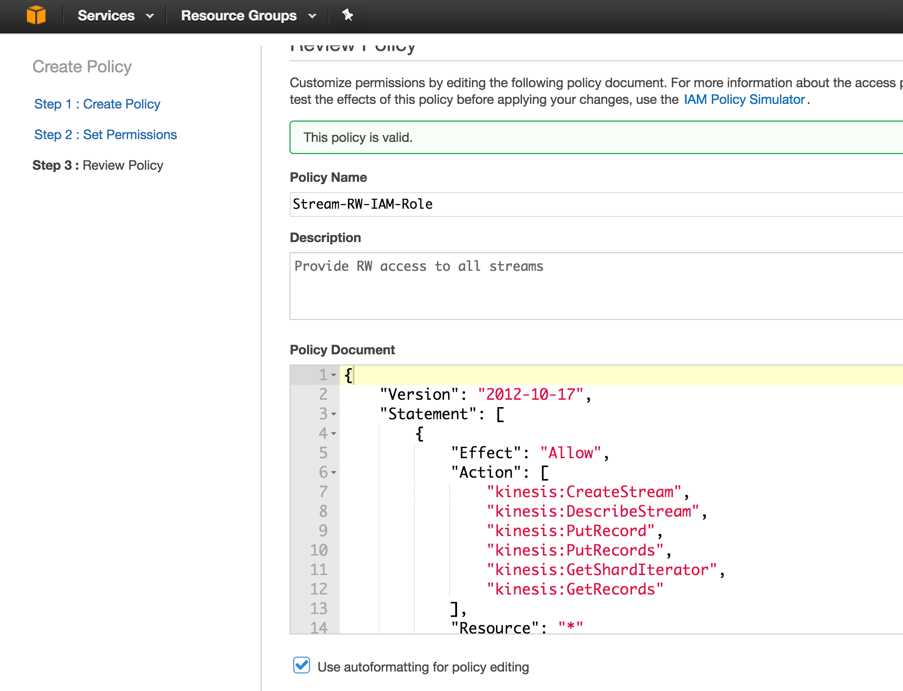

elastic compute cloud (ec2) to kinesis-stream connection example
----------------------------------------------------------------

1 - [amazonwebservice cli](https://github.com/aws/aws-cli#installation)
-----------------------------------------------------------------------
```bash
sudo pip install awscli
```

2- [kinesis IAM(Identity and Access Management)](http://docs.aws.amazon.com/streams/latest/dev/learning-kinesis-module-one-iam.html) role - [`Stream-RW-IAM-Role`](https://console.aws.amazon.com/iam/home#/policies$new)
-----------------------------------------------------------------------------------------------------------------------------------------------------------------------------------------



I dont know the difference between role and policy

```
aws iam create-role --role-name Stream-RW-IAM-Role --assume-role-policy-document file://Stream-RW-IAM-Role.json
aws iam create-policy --policy-name Stream-RW-IAM-Role --policy-document file://policy
```

```
{
  "Version": "2012-10-17",
  "Statement": [
    {
      "Effect": "Allow",
      "Action": "kinesis:*",
      "Resource": "*"
    }
  ]
}
```

```
aws iam list-roles --profile aws_creds_federated
aws iam list-policies --profile aws_creds_federated ## will list the Stream-RW-IAM-Role

        {
            "PolicyName": "Stream-RW-IAM-Role", 
            "CreateDate": "2017-04-01T07:41:43Z", 
            "AttachmentCount": 0, 
            "IsAttachable": true, 
            "PolicyId": "ANPAIRSG5BAZCQQEZOMFK", 
            "DefaultVersionId": "v1", 
            "Path": "/", 
            "Arn": "arn:aws:iam::033814027302:policy/Stream-RW-IAM-Role", 
            "UpdateDate": "2017-04-01T07:41:43Z"
        }


aws iam list-instance-profiles-for-role --role-name Stream-RW-IAM-Role --profile aws_creds_federated
```

elastic cloud instance config
-----------------------------

- [attach Stream Identity Role to elastic cloud instance](http://docs.aws.amazon.com/cli/latest/reference/iam/add-role-to-instance-profile.html)

```bash
aws iam add-role-to-instance-profile --role-name Stream-RW-IAM-Role --instance-profile-name AIPAIWEWPMRBPJ7XON6FI
```

```
[ec2-user@ip-172-18-18-8 elastic2-kinesis-connection]$ curl -XGET http://169.254.169.254/latest/meta-data/iam/info
{
  "Code" : "Success",
  "LastUpdated" : "2017-04-01T06:28:05Z",
  "InstanceProfileArn" : "arn:aws:iam::033814027302:instance-profile/Stream-RW-IAM-Role",
  "InstanceProfileId" : "AIPAIWEWPMRBPJ7XON6FI"
}
```


run artifact on elastic compute
-------------------------------

```
wget https://dl.bintray.com/sbt/native-packages/sbt/0.13.13/sbt-0.13.13.tgz

sbt-launcher-packaging-0.13.13/bin/sbt test
```

Refs
----

https://console.aws.amazon.com/iam/home?region=us-west-2#/roles

http://docs.aws.amazon.com/IAM/latest/UserGuide/id_roles_use_switch-role-ec2.html

http://docs.aws.amazon.com/IAM/latest/UserGuide/id_roles_use_switch-role-ec2_instance-profiles.html

http://docs.aws.amazon.com/codedeploy/latest/userguide/getting-started-create-iam-instance-profile.html

http://docs.aws.amazon.com/cli/latest/userguide/cli-chap-getting-started.html